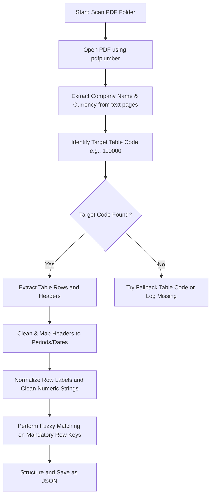

# 📄 PDF Financial Extraction System

A specialized Python-based extraction system built to programmatically parse, extract, clean, and structure financial data from Ministry of Corporate Affairs (MCA) PDF filing forms (e.g., AOC-4, standalone disclosures). Using custom extractors, the project identifies specific XBRL taxonomy sections (e.g., General Information `[400100]`, Balance Sheet `[110000]`, Profit & Loss `[100200]`, and Cash Flow `[320000]`), extracts table grids, aligns dates/periods, normalizes numbers, and compiles structured JSON outputs.

---

## 🚀 Key Features
* **🎯 Target Table Parsing**: Scans and identifies target financial table codes (e.g., `[110000]`, `[100200]`, `[400100]`) dynamically across pages.
* **🏢 Metadata Autodetect**: Extracts corporate entity names and currency units (e.g., Standalone Lakhs of INR vs. Crores) directly from the text pages.
* **📅 Multi-Period Date Alignment**: Parses reporting periods from headers dynamically, managing varied date formats (`DD/MM/YYYY`, financial years like `FY 22-23`, etc.) to align column values correctly.
* **🔢 Robust Numeric Cleaning**: Sanitizes numbers with comma-separators, currency symbols, percentages, and handles bracketed negative values (e.g. `(1,234.50)` becomes `-1234.50`).
* **🧩 Mandatory Field Mapping**: Employs SequenceMatcher fuzzy logic (`difflib`) to align variations of row labels with standardize key dictionaries.

---

## 🛠️ Project Structure

The project code is modularized inside the [main.py](file:///c:/Users/Divya%20Shinde/OneDrive/Desktop/Pdf-extraction-system/main.py) directory, with outputs stored in the [output](file:///c:/Users/Divya%20Shinde/OneDrive/Desktop/Pdf-extraction-system/output) directory.

| Component / Script | Purpose & Description | Output Target |
| :--- | :--- | :--- |
| 🧑‍💼 [Auditor.py](file:///c:/Users/Divya%20Shinde/OneDrive/Desktop/Pdf-extraction-system/main.py/Auditor.py) | Extracts auditor details (auditor firm, registration number, signing dates, SRN forms). | `auditors_data.json` |
| 📊 [Balance_sheet.py](file:///c:/Users/Divya%20Shinde/OneDrive/Desktop/Pdf-extraction-system/main.py/Balance_sheet.py) | Core balance sheet extractor targeting FBSC table `[100100]`. | [all_Balance_sheet.json](file:///c:/Users/Divya%20Shinde/OneDrive/Desktop/Pdf-extraction-system/output/all_Balance_sheet.json) |
| ⚡ [Balance_sheet(new code).py](file:///c:/Users/Divya%20Shinde/OneDrive/Desktop/Pdf-extraction-system/main.py/Balance_sheet(new%20code).py) | Enhanced balance sheet extractor targeting FBSC/NCF3 `[110000]` / `[100100]` with stop logic for Total Assets. | `Balance_sheet_CORRECTED_v2.json` |
| 📈 [Profit_&_Loss.py](file:///c:/Users/Divya%20Shinde/OneDrive/Desktop/Pdf-extraction-system/main.py/Profit_&_Loss.py) | Standard Profit & Loss extractor targeting table `[100200]`. | `P&L_sheets.json` |
| 🔥 [Profit&Loss(newcode).py](file:///c:/Users/Divya%20Shinde/OneDrive/Desktop/Pdf-extraction-system/main.py/Profit&Loss(newcode).py) | Enhanced Profit & Loss extractor targeting `[100200]` and `[210000]` with dynamic next-heading stop logic. | `Profit_and_Loss_CORRECTEDv2.json` |
| 💧 [Cash_&_Flow.py](file:///c:/Users/Divya%20Shinde/OneDrive/Desktop/Pdf-extraction-system/main.py/Cash_&_Flow.py) | Extracts cash flow statements targeting table `[100400]`. | `cashflow_sheets_fixed.json` |
| 🌊 [Cashflow(new code).py](file:///c:/Users/Divya%20Shinde/OneDrive/Desktop/Pdf-extraction-system/main.py/Cashflow(new%20code).py) | Advanced cash flow extractor targeting `[320000]` / `[100400]` with smart key matching for mandatory rows. | `cashflow_final_CORRECTED.json` |
| 🔍 [Genral_info.py](file:///c:/Users/Divya%20Shinde/OneDrive/Desktop/Pdf-extraction-system/main.py/Genral_info.py) | Extracts corporate general info tables (table `[400100]`). | `extracted_data.json` |

---

## ⚙️ Extraction Flow & Logic

The extraction process follows a robust pipeline to parse raw PDF files into structured JSON outputs:



### 1. File Discovery
Each script recursively crawls the configured directory (`FOLDER_PATH`) searching for `.pdf` files.

### 2. Company Name & Currency Detection
* **Company Names** are resolved using regex targeting common company tags (e.g. `LIMITED`, `PRIVATE LIMITED`, `LTD`) or identifying AOC-4 metadata positions.
* **Currencies** are resolved using regex matching units like `Lakhs of INR` or `crores` within the page text block.

### 3. Target Table Scanning & Page Tracking
The extraction looks for specific classification tags embedded within financial report templates:
* **General Info**: `[400100]`
* **Balance Sheet**: `[110000]` (Primary), `[100100]` (Fallback)
* **Profit & Loss**: `[100200]`, `[210000]`
* **Cash Flow**: `[320000]` (Primary), `[100400]` (Fallback)

### 4. Row Stop Logic
To prevent extraction from bleeding into subsequent sections or unrelated tables, the scripts implement dynamic stopping rules:
* In `Balance_sheet(new code).py`, parsing terminates immediately upon matching row label strings like `"total assets"` or `"total equity and liabilities"`.
* In `Profit&Loss(newcode).py`, parsing terminates when a new section heading code `[XXXXXX]` is identified on subsequent pages.

### 5. Period Mapping & Numeric Normalization
* **Date Parsing**: Date strings like `DD/MM/YYYY` or Year strings (`2022`, `2023`) are extracted from headers to create a stable dictionary structure mapped to each financial period.
* **Numeric Sanitizer**:
  ```python
  # Strips commas, currency markers, formats bracketed values into negative floats
  val = " (2,345.50) " 
  # Result: -2345.5
  ```

### 6. Fuzzy Key Matching
For standardized metrics (e.g., cash flow activities), the extractor maps parsed rows to mandatory output fields using the `difflib.SequenceMatcher` algorithm. If a parsed row is at least 65% similar to a target key, it automatically aligns the periods and values.

---

## 🗄️ Output Data Schema

Extractors save data in JSON files with structured hierarchies:

```json
{
  "document_filename": {
    "company_name": "ABC PRIVATE LIMITED",
    "page": 12,
    "statement": {
      "currency": "Lakhs of INR",
      "periods": [
        "01/04/2022 to 31/03/2023",
        "01/04/2021 to 31/03/2022"
      ],
      "data": {
        "revenue_from_operations": {
          "01/04/2022 to 31/03/2023": 12500.45,
          "01/04/2021 to 31/03/2022": 11000.20
        },
        "cost_of_materials_consumed": {
          "01/04/2022 to 31/03/2023": 4500.00,
          "01/04/2021 to 31/03/2022": 4200.50
        }
      },
      "mandatory_data": {
        "interest_paid_financing_activities": {
          "01/04/2022 to 31/03/2023": 150.00,
          "01/04/2021 to 31/03/2022": 120.00
        }
      }
    }
  }
}
```

---

## 🚀 Setup & Execution

### 📋 Prerequisites
Install the required dependencies via `pip`:
```bash
pip install pdfplumber pandas openpyxl
```

### ⚙️ Script Configuration
Before running any script, open the target file in [main.py](file:///c:/Users/Divya Shinde/OneDrive/Desktop/Pdf-extraction-system/main.py) and update the `FOLDER_PATH` variable to point to your PDF source folder:

```python
# Change this path to point to your input PDF folder
FOLDER_PATH = r"C:\Users\Divya Shinde\OneDrive\Desktop\Pdf-extraction-system\data"
```

### 💻 Running the Extractors
Run the scripts using python. For example, to run the new Balance Sheet extractor:
```bash
python "main.py/Balance_sheet(new code).py"
```

> [!NOTE]
> Ensure that you check the output directory for your extracted JSON files after execution completes.
